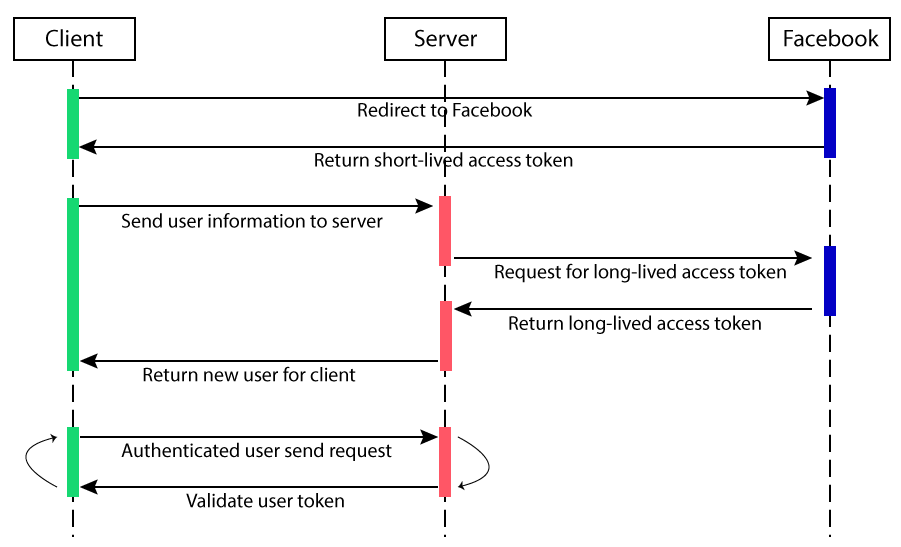

# Login by Facebook (Rails API + ReactJS)

<p align="center"></p>

### Features
 - Quick login by Facebook, store user information on backend after successfully callback.
 - Authenticated user will be auto redirect to profile page and vice versa.
 - Share user information across components by applying React Context.
 - Use cookies to set user access token on frontend which allow user can visit later without re-authenticate.

### Design flows

<p align="center"></p>

### Installation

<p align="center"></p>

#### Pull the project
1. Clone the project: `git clone https://github.com/nxt03/test-nxt03.git`.
2. Change directory: `cd test-nxt03`.
3. Switch to branch test: `git checkout test`.

#### Run backend
1. Inside project, change directory to `backend` folder using command `cd backend`.
2. Run `bundle install` to install Gem files.
3. Run `rails db:migrate` to migrate the database file, default datbase is sqlite3.
4. Set up the environment file `.env` as follows or use the default one from the project:
```
   - FACEBOOK_APP_ID=<your_app_id>
   - FACEBOOK_APP_SECRET=<your_app_secret>
```
5. Run `rails s` to start the server, default port is `3000`.

#### Run frontend
1. Open new terminal, change directory to `frontend` folder using command `cd frontend`.
2. We use [Expo](expo.io) to run the frontend, make sure you install expo client first `npm install --global expo-cli`.
3. Run `yarn install` to install all dependencies.
4. Set up the environment file `.env` as follows or use the default one from the project:
```
   - BACKEND_API=http://localhost:3000
   - FACEBOOK_APP_ID=<your_app_id>
```
5. Run `expo web` to start the server, default port is `19006`.

Open the browser and access the frontend via [http://localhost:19006](http://localhost:19006/).

### Testing

Change directory to `backend`.

#### API test with Rspec

Run `rspec`.

#### Integration test with Cucumber

Run `cucumber`.
